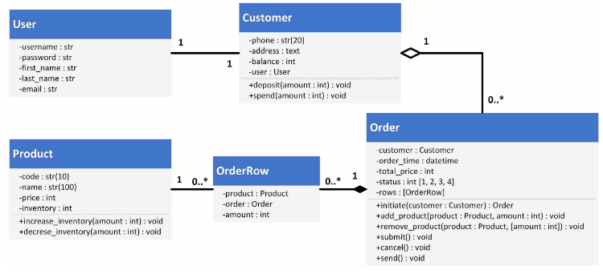

# Python_Practice

These codes are used just for learn and practice python according to Maktabkhooneh online course

## Elementary

this document is very appropriate for being familiar with python's variable (class) such as Strings, Lists, Dictionary and tuples.
Also it's very effective due to project driven that learn you how to use those.

### Final Project

hack 4 digit password with sha256 algorithm 

## Advanced

Got familiar with OOP and Working with database in Python. Also, got familiar with Web scraping and Django.

## Django

create trading application for super market.
Class diagram represented below:

